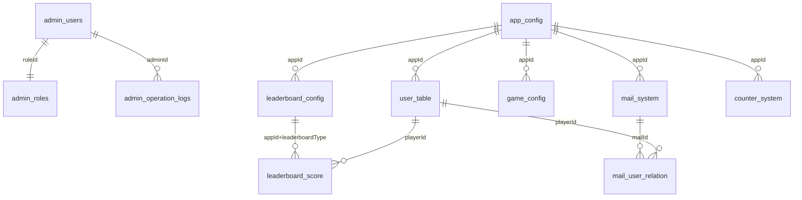

# 数据库设计文档

## 1. 数据库概述

本项目使用阿里云数据库作为数据存储，采用NoSQL文档型数据库设计，支持JSON格式数据存储。

### 1.1 设计原则
- **多租户隔离**: 每个应用拥有独立的用户表
- **数据一致性**: 关键操作采用事务保证
- **扩展性**: 支持水平扩展和分片
- **性能优化**: 合理的索引设计和查询优化

### 1.2 命名规范
- 集合名使用下划线命名法（snake_case）
- 字段名使用驼峰命名法（camelCase）
- 索引名使用描述性命名

---

## 2. 核心数据表设计

### 2.1 管理员系统

#### admin_users - 管理员用户表
```json
{
    "_id": "ObjectId",
    "username": "string",          // 用户名（唯一）
    "password": "string",          // 密码哈希
    "nickname": "string",          // 昵称
    "email": "string",            // 邮箱
    "phone": "string",            // 手机号
    "roleId": "string",           // 角色ID
    "status": "string",           // 状态: active/inactive/locked
    "token": "string",            // 当前登录Token
    "tokenExpire": "datetime",    // Token过期时间
    "lastLoginTime": "datetime",  // 最后登录时间
    "lastLoginIp": "string",      // 最后登录IP
    "loginFailCount": "number",   // 登录失败次数
    "lockTime": "datetime",       // 账户锁定时间
    "createTime": "datetime",     // 创建时间
    "updateTime": "datetime",     // 更新时间
    "createdBy": "string"         // 创建者
}
```

**索引设计:**
```javascript
// 唯一索引
{ "username": 1 }           // 用户名唯一索引
{ "email": 1 }              // 邮箱唯一索引
{ "token": 1 }              // Token索引

// 复合索引
{ "username": 1, "status": 1 }  // 登录查询索引
{ "roleId": 1, "status": 1 }    // 角色查询索引
```

#### admin_roles - 管理员角色表
```json
{
    "_id": "ObjectId",
    "roleId": "string",           // 角色ID（唯一）
    "roleName": "string",         // 角色名称
    "description": "string",      // 角色描述
    "permissions": ["string"],    // 权限列表
    "level": "number",           // 角色级别（用于权限层级）
    "status": "string",          // 状态: active/inactive
    "isSystem": "boolean",       // 是否系统内置角色
    "createTime": "datetime",    // 创建时间
    "updateTime": "datetime",    // 更新时间
    "createdBy": "string"        // 创建者
}
```

**权限列表定义:**
```javascript
permissions: [
    "admin_manage",      // 管理员管理
    "role_manage",       // 角色管理
    "app_manage",        // 应用管理
    "user_manage",       // 用户管理
    "leaderboard_manage", // 排行榜管理
    "stats_view",        // 统计查看
    "mail_manage",       // 邮件管理
    "config_manage",     // 配置管理
    "*"                  // 超级权限
]
```

#### admin_operation_logs - 管理员操作日志表
```json
{
    "_id": "ObjectId",
    "adminId": "string",          // 管理员ID
    "username": "string",         // 管理员用户名
    "action": "string",           // 操作类型: CREATE/UPDATE/DELETE/VIEW
    "resource": "string",         // 操作资源: APP/USER/LEADERBOARD等
    "details": "object",          // 操作详情
    "ip": "string",              // IP地址
    "userAgent": "string",       // 用户代理
    "result": "string",          // 操作结果: SUCCESS/FAILED
    "errorMsg": "string",        // 错误信息
    "duration": "number",        // 操作耗时(ms)
    "createTime": "datetime"     // 创建时间
}
```

### 2.2 应用管理系统

#### app_config - 应用配置表
```json
{
    "_id": "ObjectId",
    "appId": "string",           // 应用ID（唯一）
    "appName": "string",         // 应用名称
    "description": "string",     // 应用描述
    "channelAppKey": "string",   // 渠道应用密钥
    "appSecret": "string",       // 应用密钥
    "category": "string",        // 应用分类: game/tool/social
    "platform": "string",       // 平台: alipay/wechat/baidu
    "status": "string",          // 状态: active/inactive/pending
    "version": "string",         // 当前版本
    "minVersion": "string",      // 最低支持版本
    "settings": "object",        // 应用设置
    "userCount": "number",       // 用户数量
    "scoreCount": "number",      // 分数记录数
    "dailyActive": "number",     // 日活跃用户
    "monthlyActive": "number",   // 月活跃用户
    "createTime": "datetime",    // 创建时间
    "updateTime": "datetime",    // 更新时间
    "createdBy": "string"        // 创建者
}
```

**索引设计:**
```javascript
{ "appId": 1 }                  // 应用ID唯一索引
{ "status": 1, "createTime": -1 } // 状态和时间复合索引
{ "category": 1, "platform": 1 }  // 分类和平台索引
{ "createdBy": 1 }              // 创建者索引
```

#### user_{appId} - 用户表（每个应用独立）
```json
{
    "_id": "ObjectId",
    "openId": "string",          // 用户唯一标识
    "playerId": "string",        // 玩家ID（唯一，自动生成）
    "token": "string",           // 登录Token
    "nickname": "string",        // 昵称
    "avatar": "string",          // 头像URL
    "data": "object",            // 游戏数据
    "level": "number",           // 等级
    "exp": "number",             // 经验值
    "coin": "number",            // 金币
    "diamond": "number",         // 钻石
    "vipLevel": "number",        // VIP等级
    "banned": "boolean",         // 是否封禁
    "banReason": "string",       // 封禁原因
    "banExpire": "datetime",     // 封禁到期时间
    "loginCount": "number",      // 登录次数
    "lastLoginTime": "datetime", // 最后登录时间
    "lastLoginIp": "string",     // 最后登录IP
    "registerTime": "datetime",  // 注册时间
    "gmtCreate": "datetime",     // 创建时间
    "gmtModify": "datetime"      // 修改时间
}
```

**索引设计:**
```javascript
{ "openId": 1 }                    // openId唯一索引
{ "playerId": 1 }                  // playerId唯一索引
{ "token": 1 }                     // token索引
{ "gmtModify": -1 }                // 活跃度查询索引
{ "gmtCreate": -1 }                // 注册时间索引
{ "banned": 1, "banExpire": 1 }    // 封禁状态索引
```

### 2.3 排行榜系统

#### leaderboard_config - 排行榜配置表
```json
{
    "_id": "ObjectId",
    "appId": "string",              // 应用ID
    "leaderboardType": "string",    // 排行榜类型（唯一标识）
    "name": "string",               // 排行榜名称
    "description": "string",        // 排行榜描述
    "scoreType": "string",          // 分数类型: higher_better/lower_better
    "maxRank": "number",           // 最大排名数量
    "enabled": "boolean",          // 是否启用
    "category": "string",          // 排行榜分类
    "resetType": "string",         // 重置类型: permanent/daily/weekly/monthly/custom
    "resetValue": "number",        // 自定义重置间隔(小时)
    "resetTime": "datetime",       // 下次重置时间
    "updateStrategy": "number",    // 更新策略: 0=最高分, 1=最新分, 2=累计分
    "sort": "number",             // 排序方式: 0=升序, 1=降序
    "scoreCount": "number",       // 分数记录数
    "participantCount": "number", // 参与人数
    "lastResetTime": "datetime",  // 上次重置时间
    "createTime": "datetime",     // 创建时间
    "updateTime": "datetime",     // 更新时间
    "createdBy": "string"         // 创建者
}
```

**索引设计:**
```javascript
{ "appId": 1, "leaderboardType": 1 }  // 应用和排行榜类型复合唯一索引
{ "appId": 1, "enabled": 1 }          // 应用和启用状态索引
{ "resetTime": 1 }                    // 重置时间索引（定时任务使用）
```

#### leaderboard_score - 排行榜分数表
```json
{
    "_id": "ObjectId",
    "appId": "string",              // 应用ID
    "leaderboardType": "string",    // 排行榜类型
    "playerId": "string",          // 玩家ID
    "score": "number",             // 分数
    "nickname": "string",          // 玩家昵称
    "avatar": "string",            // 玩家头像
    "extraData": "object",         // 额外数据
    "submitTime": "datetime",      // 提交时间
    "updateTime": "datetime",      // 更新时间
    "season": "string"             // 赛季标识
}
```

**索引设计:**
```javascript
{ "appId": 1, "leaderboardType": 1, "playerId": 1 }  // 复合唯一索引
{ "appId": 1, "leaderboardType": 1, "score": -1 }    // 排行榜分数索引
{ "appId": 1, "leaderboardType": 1, "rank": 1 }      // 排名索引
{ "submitTime": -1 }                                  // 提交时间索引
```

### 2.4 游戏配置系统

#### game_config - 游戏配置表
```json
{
    "_id": "ObjectId",
    "appId": "string",           // 应用ID
    "configKey": "string",       // 配置键名
    "configValue": "any",        // 配置值（支持任意JSON类型）
    "version": "string",         // 游戏版本（可选，为空表示全局配置）
    "description": "string",     // 配置描述
    "configType": "string",      // 配置类型: string/number/boolean/object/array
    "isActive": "boolean",       // 是否激活
    "priority": "number",        // 优先级（版本配置覆盖全局配置）
    "tags": ["string"],         // 标签
    "createTime": "datetime",    // 创建时间
    "updateTime": "datetime",    // 更新时间
    "createdBy": "string"        // 创建者
}
```

**索引设计:**
```javascript
{ "appId": 1, "configKey": 1, "version": 1 }  // 复合唯一索引
{ "appId": 1, "isActive": 1 }                 // 应用和激活状态索引
{ "appId": 1, "version": 1 }                  // 版本查询索引
```

### 2.5 邮件系统

#### mail_system - 邮件系统表
```json
{
    "_id": "ObjectId",
    "appId": "string",           // 应用ID
    "mailId": "string",          // 邮件ID（唯一）
    "title": "string",           // 邮件标题
    "content": "string",         // 邮件内容
    "type": "string",            // 邮件类型: system/activity/reward
    "sender": "string",          // 发送者
    "targets": ["string"],       // 目标用户（all表示全体）
    "targetType": "string",      // 目标类型: all/specific/condition
    "condition": "object",       // 发送条件
    "rewards": ["object"],       // 奖励列表
    "status": "string",          // 状态: draft/sent/expired
    "sendTime": "datetime",      // 发送时间
    "expireTime": "datetime",    // 过期时间
    "readCount": "number",       // 已读数量
    "totalCount": "number",      // 总发送数量
    "createTime": "datetime",    // 创建时间
    "updateTime": "datetime",    // 更新时间
    "createdBy": "string"        // 创建者
}
```

#### mail_user_relation - 用户邮件关系表
```json
{
    "_id": "ObjectId",
    "appId": "string",           // 应用ID
    "mailId": "string",          // 邮件ID
    "playerId": "string",        // 玩家ID
    "status": "string",          // 状态: unread/read/claimed/expired
    "readTime": "datetime",      // 阅读时间
    "claimTime": "datetime",     // 领取时间
    "createTime": "datetime"     // 创建时间
}
```

### 2.6 计数器系统

#### counter_system - 计数器系统表
```json
{
    "_id": "ObjectId",
    "appId": "string",           // 应用ID
    "counterKey": "string",      // 计数器键名
    "description": "string",     // 计数器描述
    "value": "number",           // 当前值
    "initialValue": "number",    // 初始值
    "step": "number",            // 递增步长
    "maxValue": "number",        // 最大值限制
    "resetType": "string",       // 重置类型: never/daily/weekly/monthly
    "resetTime": "datetime",     // 下次重置时间
    "lastResetTime": "datetime", // 上次重置时间
    "category": "string",        // 分类
    "tags": ["string"],         // 标签
    "createTime": "datetime",    // 创建时间
    "updateTime": "datetime",    // 更新时间
    "createdBy": "string"        // 创建者
}
```

**索引设计:**
```javascript
{ "appId": 1, "counterKey": 1 }    // 应用和计数器键复合唯一索引
{ "resetTime": 1 }                 // 重置时间索引
```

---

## 3. 数据表关系图



---

## 4. 索引优化策略

### 4.1 查询频率分析
**高频查询:**
- 用户登录验证 (token查询)
- 排行榜数据查询 (score排序)
- 应用列表查询 (status筛选)
- 配置查询 (key-value查询)

**中频查询:**
- 统计数据查询 (时间范围查询)
- 用户活跃度查询 (时间字段查询)
- 邮件列表查询 (状态筛选)

### 4.2 索引建议

#### 必建索引
```javascript
// 用户表
db.user_{appId}.createIndex({ "openId": 1 }, { unique: true })
db.user_{appId}.createIndex({ "token": 1 })
db.user_{appId}.createIndex({ "gmtModify": -1 })

// 排行榜分数表
db.leaderboard_score.createIndex({ 
    "appId": 1, 
    "leaderboardType": 1, 
    "score": -1 
})

// 应用配置表
db.app_config.createIndex({ "appId": 1 }, { unique: true })
db.app_config.createIndex({ "status": 1, "createTime": -1 })
```

#### 性能优化索引
```javascript
// 复合索引优化排行榜查询
db.leaderboard_score.createIndex({ 
    "appId": 1, 
    "leaderboardType": 1, 
    "rank": 1 
})

// 用户活跃度统计优化
db.user_{appId}.createIndex({ 
    "gmtCreate": -1, 
    "status": 1 
})

// 邮件系统查询优化
db.mail_user_relation.createIndex({ 
    "playerId": 1, 
    "status": 1, 
    "createTime": -1 
})
```

---

## 5. 数据分片策略

### 5.1 水平分片
**用户表分片:**
- 按appId分片：每个应用独立用户表
- 分片键：appId
- 优势：数据隔离，性能提升

**排行榜分片:**
- 按appId+leaderboardType分片
- 分片键：appId
- 优势：排行榜查询性能优化

### 5.2 垂直分片
**日志表分离:**
- 操作日志独立存储
- 统计数据独立存储
- 优势：减少主表压力

---

## 6. 数据备份策略

### 6.1 备份方案
**增量备份:**
- 频率：每小时
- 保留：7天
- 范围：所有变更数据

**全量备份:**
- 频率：每天
- 保留：30天
- 范围：所有数据

### 6.2 恢复策略
**灾难恢复:**
- RTO：4小时内
- RPO：1小时内
- 多地域备份

---

## 7. 监控指标

### 7.1 性能监控
- 查询响应时间
- 慢查询监控
- 连接池使用率
- 索引命中率

### 7.2 容量监控
- 存储空间使用率
- 数据增长趋势
- 集合大小监控
- 索引大小监控

### 7.3 业务监控
- 用户注册量
- 活跃用户数
- 分数提交量
- 邮件发送量

---

## 8. 数据安全

### 8.1 访问控制
- 数据库用户权限控制
- IP白名单限制
- SSL加密传输

### 8.2 数据加密
- 敏感字段加密存储
- 密码哈希加盐
- Token加密生成

### 8.3 审计日志
- 数据访问日志
- 修改操作日志
- 异常操作告警
