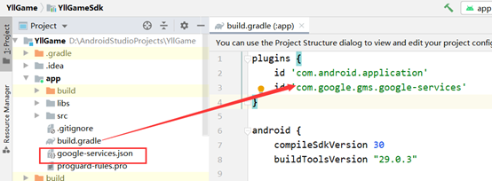
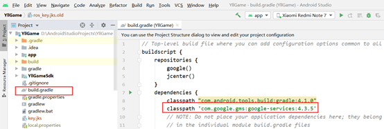

# Android Google接入文档

## SDK结构
支持平台：Android</br>
系统要求: Android6.0+ </br>
环境要求: Android Studio</br>
支持语言：ar阿语 en英语 tr土耳其语 zh简体中文 zhtc繁体中文 th泰语 ja日语 ko韩语</br>

## 1.接入流程
### 1.1集成AAR包
首先把AAR包复制到项目的lib目录下，然后在主项目APP的工程下build.gradle 中的dependencies加入
 ``` Groovy
 //SDK基础库
 implementation(name: 'YllGameSdk', ext: 'aar') 
 //geetest
 api(name: 'geetest_captcha_android', ext: 'aar')
 ```
 ### 1.2设置项目的libs文件目录和过滤so
 在主项目APP的工程下build.gradle 中的android加入
  ``` Groovy
 repositories {
        flatDir {
            dirs 'libs'
        }
    }
    packagingOptions {
        doNotStrip "*/*/libijiami*.so"
    }
 ```
 ### 1.3 导入SDK中所需第三方库
   ``` Groovy
   //Android X支持库  必须添加
    api 'com.google.android.material:material:1.3.0'
    api 'androidx.appcompat:appcompat:1.2.0'
    //okhttp网络请求库 必须添加
    api("com.squareup.okhttp3:okhttp:4.9.0")
    //gson数据解析库 必须添加
    api 'com.google.code.gson:gson:2.8.5'
    //Facebook登陆依赖库 必须添加
    api 'com.facebook.android:facebook-login:17.0.0'
    //Facebook分享
    api 'com.facebook.android:facebook-share:17.0.0'
    //Google登陆依赖库 必须添加
    googleApi "androidx.credentials:credentials:1.2.2"
    googleApi "androidx.credentials:credentials-play-services-auth:1.2.2"
    googleApi "com.google.android.libraries.identity.googleid:googleid:1.1.1"
    googleApi "com.google.android.gms:play-services-ads-identifier:18.1.0"
    //Google支付依赖库 必须添加
    api "com.android.billingclient:billing:7.0.0"
    //数据库依赖库 必须添加
    def room_version = "2.2.5"
    api "androidx.room:room-runtime:$room_version"
    annotationProcessor "androidx.room:room-compiler:$room_version"
    api "net.zetetic:sqlcipher-android:4.6.1@aar"
    //数据统计依赖库 必须添加
    api 'com.appsflyer:af-android-sdk:6.10.3@aar'
    api 'com.appsflyer:oaid:6.9.0'
    api 'com.android.installreferrer:installreferrer:2.2'
    api 'com.adjust.sdk:adjust-android:4.38.5'
    //FCM 推送相关
    api platform('com.google.firebase:firebase-bom:33.1.2')
    api 'com.google.firebase:firebase-messaging'
    api 'com.google.firebase:firebase-analytics'
    api 'com.aliyun.dpa:oss-android-sdk:2.9.9'
    //图片加载库
    api 'com.github.bumptech.glide:glide:4.13.2'
    annotationProcessor 'com.github.bumptech.glide:compiler:4.13.2'
    //Crash
    api 'com.google.firebase:firebase-crashlytics'
    api 'com.google.firebase:firebase-crashlytics-ndk'
    //ADJust Meta插件
    api 'com.adjust.sdk:adjust-android-meta-referrer:5.0.0'
 ```
 ### 1.4 设置项目build.gradle
   ``` Groovy
   buildscript {
    repositories {
        google()
        jcenter()
        maven { url 'https://repo.onestore.net/repository/onestore-sdk-public' }
    }
    dependencies {
        ...
        classpath 'com.google.gms:google-services:4.3.14'
        classpath 'org.jetbrains.kotlin:kotlin-gradle-plugin:1.5.30'
        // Google Carsh
        classpath 'com.google.firebase:firebase-crashlytics-gradle:2.9.1'
    }
}

allprojects {
    repositories {
        google()
        jcenter()
        maven { url 'https://repo.onestore.net/repository/onestore-sdk-public' }
    }
}
 ```

## 2.项目配置，初始化
### 2.1初始化Application
在项目的application的onCreate函数中调用SDK的初始化函数，并且调用SDK的设置语言函数。
- SDK初始化函数：``` YllGameSdk.getInstance().init(); ```
``` java 
 /**
     * 初始化
     *
     * @param application
     * @param ygInitConfig YallaGameSDK接入所需信息
     */
    public void init(Application application, YGInitConfig ygInitConfig)

     /**
     * @param gameAppId              YallaGame 游戏Id
     * @param googleClientId         Google登陆client Id
     * @param appsFlyersDevKey       appsFlyersDevKey
     * @param adJustToken            adJustToken
     * @param adJustTrackerLinkToken adJustLinkToken
     * @param facebookAppId          facebookAppId
     * @param enableAppsFlyers       是否开启AppsFlyers上报
     * @param enableAdjust           是否开启Adjust上报
     * @param enableFacebook         是否开启Facebook事件上报
     */
    public YGInitConfig(String gameAppId, String googleClientId, String appsFlyersDevKey, String adJustToken, String adJustTrackerLinkToken, String facebookAppId, boolean enableAppsFlyers, boolean enableAdjust, boolean enableFacebook) {
        this.gameAppId = gameAppId;
        this.googleClientId = googleClientId;
        this.appsFlyersDevKey = appsFlyersDevKey;
        this.adJustToken = adJustToken;
        this.adJustTrackerLinkToken = adJustTrackerLinkToken;
        this.facebookAppId = facebookAppId;
        this.enableAppsFlyers = enableAppsFlyers;
        this.enableAdjust = enableAdjust;
        this.enableFacebook = enableFacebook;
    }
 ```
 - SDK 设置语言集合函数：``` YllGameSdk.setLanguageList(); ```
``` java 
    /**
     * 设置SDK支持语言，必须调用在init之前
     *
     * @param languageList 游戏支持语言集合 现支持 ar阿语 en英语 tr土耳其语 zh简体中文 zhtc繁体中文 th泰语 ja日语 ko韩语 该集合默认第一个是SDK的默认语言
     */
    public static void setLanguageList(List<String> languageList) 
 ```
 - SDK设置语言函数函数：``` YllGameSdk.setLanguage(); ```
``` java 
    /**
     * 设置SDK默认语言
     *
     * @param localLanguage ar阿语 en英语 tr土耳其语 zh简体中文 zhtc繁体中文 th泰语 ja日语 ko韩语
     */
    public static void setLanguage(String localLanguage)
 ```
- 调用设置弱联网函数为：``  YllGameSdk.setNetMode(int mode); ``
``` java
     /**
     * 设置SDK联网默认模式 默认强联网模式
     *
     * @param mode  YGConstants.SDK_STRONG_NET 强联网 YGConstants.SDK_WEAK_NET 弱联网
     */
    public static void setNetMode(int mode)
```
- 调用当前游戏服务协议函数为：``  YllGameSdk.setTermsService(String termsServiceURL); ``
``` java
    /**
     * 当前游戏服务协议
     *
     * @param termsServiceURL 游戏服务协议网址
     */
    public static void setTermsService(String termsServiceURL)
```
- 调用当前游戏隐私政策函数为：``  YllGameSdk.setPrivacyPolicy(String privacyPolicyURL); ``
``` java
    /**
     * 当前游戏隐私政策
     *
     * @param privacyPolicyURL 游戏隐私政策网址
     */
    public static void setPrivacyPolicy(String privacyPolicyURL)
```
**（注：项目的application要在AndroidManifest中注册，项目中初始化参数的key 找运营方）**
### 2.2配置Facebook
在项目中的AndroidManifest中添加
``` xml
        <activity
            android:name="com.facebook.FacebookActivity"
            android:configChanges="keyboard|keyboardHidden|screenLayout|screenSize|orientation"
            android:exported="true"
            android:label="@string/app_name" />
        <activity
            android:name="com.facebook.CustomTabActivity"
            android:exported="true">
            <intent-filter>
                <action android:name="android.intent.action.VIEW" />
                <category android:name="android.intent.category.DEFAULT" />
                <category android:name="android.intent.category.BROWSABLE" />
                <data android:scheme="@string/fb_login_protocol_scheme" />
            </intent-filter>
        </activity>
        <meta-data
            android:name="com.facebook.sdk.ApplicationId"
            android:value="@string/facebook_app_id" /> 
        <meta-data
            android:name="com.facebook.sdk.ClientToken"
            android:value="**************" />
        <!--    是否开启通知权限检查    -->
        <meta-data
            android:name="com.yllgamesdk.checkNotificationsEnabled"
            android:value="true" />
```
``` xml
    <string name="facebook_app_id" translatable="false">15793xxxxxxxxxx</string>
    <string name="fb_login_protocol_scheme" translatable="false">fb15793xxxxxxxxxx</string>
```
**（注：facebook_app_id和fb_login_protocol_scheme 在Android项目string里，需要接入者自行变更为游戏的Facebook的APPID）**
### 2.3注册登陆Receiver
在项目中的AndroidManifest中注册
``` xml
        <receiver
            android:name="游戏包名.ygapi.YGLoginReceiver"
            android:exported="true">
            <intent-filter>
                <action android:name="com.yllgame.sdk.loginReceiver" />
            </intent-filter>
        </receiver>
```
``` java
public class YGLoginReceiver extends BroadcastReceiver {
    @Override
    public void onReceive(Context context, Intent intent) {
        //Constants.BROADCAST_RECEIVER_LOGIN_ACTION SDK中登陆的action
        if (intent.getAction() == YGConstants.BROADCAST_RECEIVER_LOGIN_ACTION) {
            //拿到登陆之后的用户信息
            GameUserInfoEntity userInfoEntity = (GameUserInfoEntity) intent.getExtras().getSerializable(YGConstants.BROADCAST_RECEIVER_LOGIN_INFO_KEY);
            //该示例中通过EventBus通知并且更新主界面的更新 具体的结合自身需求修改
            if (userInfoEntity.getType() == GameUserInfoEntity.TYPE_LOGIN_ACCOUNT_SUCCESS) {
                //登陆成功
                //需要设置语言
                YllGameSdk.setLanguage(userInfoEntity.getLastRegion());
            } else if (userInfoEntity.getType() == GameUserInfoEntity.TYPE_LOGIN_ACCOUNT_FAIL) {
                //登陆失败
            } else if (userInfoEntity.getType() == GameUserInfoEntity.TYPE_FAIL_ACCOUNT_REMOTE) {
                //账号异地登录 SDK内部会有弹窗 必须退出到登陆界面清除用户信息
            } else if (userInfoEntity.getType() == GameUserInfoEntity.TYPE_FAIL_ACCOUNT_BLOCKED) {
                //账号被封 SDK内部会有弹窗 退出到登陆界面
            } else if (userInfoEntity.getType() == GameUserInfoEntity.TYPE_FAIL_TOKEN_OVERDUE) {
                //账号Token过期 退出到登陆界面
            } else if (userInfoEntity.getType() == GameUserInfoEntity.TYPE_ACCOUNT_CHANGE_USERNAME) {
                //修改昵称成功
            } else if (userInfoEntity.getType() == GameUserInfoEntity.TYPE_ACCOUNT_LOGIN_OUT) {
                //退出登录
            }else if (userInfoEntity.getType() == GameUserInfoEntity.TYPE_FAIL_ACCOUNT_EXPIRED) {
                //账号过期退出到登陆界面
            }
        }
    }
}
```
注：项目中所有登陆以都会通过广播通知并且在下发用户信息，YGLoginReceiver为固定写法，该广播放在项目包名.ygapi下
退出登录要退出到登陆界面并且清除本地用户信息
### 2.4注册YGReceiver
在项目中的AndroidManifest中注册
``` xml
        <receiver
            android:name="游戏包名.ygapi.YGReceiver"
            android:exported="true">
            <intent-filter>
                <action android:name="com.yllgame.sdk.payDropOrderReceiver" />
             <action android:name="com.yllgame.sdk.accountBindReceiver" />
            </intent-filter>
        </receiver>
```
``` java
public class YGReceiver extends BroadcastReceiver {
    @Override
    public void onReceive(Context context, Intent intent) {
        if (intent.getAction() == YGConstants.BROADCAST_RECEIVER_PAY_DROP_ORDER_ACTION) {
            String orderId = intent.getExtras().getString(YGConstants.BROADCAST_RECEIVER_PAY_ORDER_ID_KEY);
            LogUtils.logEForDeveloper("游戏充值订单编号：" + orderId);
        } else if (intent.getAction() == YGConstants.BROADCAST_RECEIVER_ACCOUNT_BIND_ACTION) {
            GameUserAccountBindEntity gameUserAccountBindEntity = (GameUserAccountBindEntity) intent.getExtras().getSerializable(YGConstants.BROADCAST_RECEIVER_ACCOUNT_BIND_INFO_KEY);
            /**
             *     private int isBindFacebook = 1 绑定facebook
             *     private int isBindGoogle = 1 绑定谷歌
             *     private int isBindPhone = 1 绑定手机
             *     private int isBindHuaWei = 1 绑定华为
             */
        }else if (intent.getAction() == YGConstants.BROADCAST_RECEIVER_LANGUAGE_ACTION) {
            String region = intent.getExtras().getString(YGConstants.BROADCAST_RECEIVER_LANGUAGE_INFO_KEY);
            LogUtils.logEForDeveloper("获取到初始化语言：" + region);
        }
    }
}
```
注：YGReceiver为固定写法，该广播放在项目包名.ygapi下
### 2.5 设置allowBackup配置
``` android:allowBackup="false" ```</br>
**注：新生成的项目allowBackup为true，须在项目的AndroidManifest中application设置allowBackup为false**
### 2.6 Firebase Crash配置
#### 配置Crashlytics Gradle plugin
```  
//（在项目的build.gradle添加）
classpath 'com.google.firebase:firebase-crashlytics-gradle:2.9.1'
```
```  
//（在app的build.gradle plugins添加）
id 'com.google.firebase.crashlytics'
android{
    ...
   buildTypes {
        release{
            ...
            firebaseCrashlytics {
                //每次打包前 需要运行uploadCrashlyticsSymbolFileRelease任务
                nativeSymbolUploadEnabled true
                //打包前检查改路劲是否有so文件
                unstrippedNativeLibsDir 'build/intermediates/merged_native_libs/debug/out/lib'
            }
        }
    }
}
```
#### 上传符号表
##### 1、运行Android studio右侧Gradle工具栏

##### 2、点开当前app的Tasks>build>assemble 点击运行，注意观看控制台Run输出
**BUILD SUCCESSFUL in 3m 28s\
Build Analyzer results available\
Task execution finished 'assemble'.则代表执行完成**

##### 3、点开当前app的Tasks>firebase crashlytics>uploadCrashlyticsSymbolFile(需要打包debug则上传uploadCrashlyticsSymbolFileDebug，需要打包release则上传uploadCrashlyticsSymbolFileRelease) 点击运行，注意观看控制台Run输出
**Task :hello_world:generateCrashlyticsSymbolFileDebug\
Task :hello_world:processDebugGoogleServices UP-TO-DATE\
Task :hello_world:uploadCrashlyticsSymbolFileDebug\
BUILD SUCCESSFUL in 3m 28s\
Build Analyzer results available\
Task execution finished 'uploadCrashlyticsSymbolFileDebug'.则代表符号表上传成功**

### 2.7 YallaGameSDK横竖屏设置
 * 如果游戏为竖屏，在AndroidManifest.xml内添加如下配置
```
        <activity
            android:name="com.yllgame.sdk.ui.AccountManagerActivity"
            android:configChanges="orientation|screenSize"
            android:exported="false"
            android:screenOrientation="portrait"
            android:theme="@style/YllGameSdkActivityTheme" >
        </activity>
        <activity
            android:name="com.yllgame.sdk.ui.AccountBindActivity"
            android:configChanges="orientation|screenSize"
            android:screenOrientation="portrait"
            android:exported="false"
            android:theme="@style/YllGameSdkActivityTheme" >
        </activity>
```
 * 如果游戏为横屏，在AndroidManifest.xml内添加如下配置
```
        <activity
            android:name="com.yllgame.sdk.ui.AccountManagerActivity"
            android:configChanges="orientation|screenSize"
            android:exported="false"
            android:screenOrientation="landscape"
            android:theme="@style/YllGameSdkActivityTheme" >
        </activity>
        <activity
            android:name="com.yllgame.sdk.ui.AccountBindActivity"
            android:configChanges="orientation|screenSize"
            android:screenOrientation="landscape"
            android:exported="false"
            android:theme="@style/YllGameSdkActivityTheme" >
        </activity>
```
 * 如果游戏为跟随传感器横屏，在AndroidManifest.xml内添加如下配置
```
        <activity
            android:name="com.yllgame.sdk.ui.AccountManagerActivity"
            android:configChanges="orientation|screenSize"
            android:exported="false"
            android:screenOrientation="sensorLandscape"
            android:theme="@style/YllGameSdkActivityTheme" >
        </activity>
        <activity
            android:name="com.yllgame.sdk.ui.AccountBindActivity"
            android:configChanges="orientation|screenSize"
            android:screenOrientation="sensorLandscape"
            android:exported="false"
            android:theme="@style/YllGameSdkActivityTheme" >
        </activity>
```
## 3.SDK Api接口

### 3.1 登陆
- SDK调起登陆函数：``` YGLoginApi.getInstance().login(); ```
``` java
    /**
     * 登陆界面
     *
     * @param activity 当前Activity
     */
    public void login(Activity activity)
```
### 3.2 游客静默登陆
- SDK调起静默游客登陆函数：``` YGLoginApi.getInstance().silentGuestLogin(); ```
``` java
    /**
     * 静默游客登录
     */
    public void silentGuestLogin()
```
### 3.3 同步角色与回调
 - SDK调起同步用户角色的函数：``` YGUserApi.getInstance().syncRoleInfo(); ```
``` java 
    /**
     * 同步角色信息
     *
     * @param roleId：角色id              ：int 必要参数
     * @param roleName：角色名称          ：string 必要参数
     * @param roleLevel：角色等级         ：int 必要参数
     * @param roleVipLevel：角色Vip等级   ：int 必要 没有默认0
     * @param serverId：角色所在服务器id   ：int 必要参数
     * @param roleCastleLevel：城堡等级   ：int 必要 没有默认0
     * @param callback：同步角色回调:       true 同步成功 false 同步失败
     */
    public void syncRoleInfo(String roleId,
                             String roleName,
                             String roleLevel,
                             String roleVipLevel,
                             String serverId,
                             String roleCastleLevel,
                             YGBooleanCallBack callback)
```
**注：建议游戏每次登陆、角色创建、用户角色升级，用户VIP升级必须调用该函数**
### 3.4 谷歌内购充值与回调
- SDK调起谷歌支付的函数为：`` YGPayApi.pay() ``
``` java 
    /**
     * 支付
     *
     * @param activity      当前activity
     * @param roleId        角色id
     * @param roleServiceId 角色服务器Id
     * @param sku           商品的sku
     * @param cpNo          支付的订单号
     * @param cpTime        支付订单的创建时间
     * @param number        支付的数量 目前为1
     * @param amount        支付的金额
     * @param pointId       支付的充值点
     * @param listener      支付的回调
     */
    public static synchronized void pay(Activity activity, String roleId
                                        String roleServiceId, String sku,
                                        String cpNo, String cpTime,
                                        String number, String amount,
                                        String pointId, YGPaymentListener listener)
```
### 3.5 谷歌充值与回调
- SDK调起谷歌支付的函数为：`` YGPayApi.paySubs() ``
``` java 
    /**
     * 订阅
     *
     * @param activity      当前activity
     * @param roleId        角色id
     * @param roleServiceId 角色服务器Id
     * @param sku           商品的sku
     * @param cpNo          支付的订单号
     * @param cpTime        支付订单的创建时间
     * @param number        支付的数量 目前为1
     * @param amount        支付的金额
     * @param pointId       支付的充值点
     * @param listener      支付的回调
     */
    public static synchronized void paySubs(Activity activity, String roleId
                                        String roleServiceId, String sku,
                                        String cpNo, String cpTime,
                                        String number, String amount,
                                        String pointId, YGPaymentListener listener)
```
注：支付和订阅需要角色信息和网络支持，如果没有登录，需要先调用登录并同步角色
### 3.6 打开SDK设置界面
- SDK调起设置界面的函数为：`` YGUserApi.getInstance().showSettingsView ``
``` java
    /**
     * 设置界面
     *
     * @param activity  当前activity
     * @param serviceId 角色服务器id
     * @param roleId    角色id
     */
    public void showSettingsView(Activity activity, String serviceId, String roleId)
```
### 3.7 打开修改昵称界面
 - SDK调起修改昵称的函数：``` YGUserApi.getInstance().showUpdateNickNameDialog() ```
``` java 
    /**
     * 修改用户昵称
     *
     * @param activity
     * @param listener 修改昵称回调
     */
    public void showUpdateNickNameDialog(Activity activity, UpdateUserNameListener listener)
```
### 3.8 打开用户管理界面
- SDK调起用户管理界面的函数：``` YGUserApi.getInstance().openAccountManager(this) ```
``` java 
    /**
     * 修改用户昵称
     *
     * @param activity
     */
    public void openAccountManager(Activity activity)
```
### 3.9 检查账号绑定
- SDK调起账号升级的函数为：`` YGUserApi.getInstance().checkBindStat ``
``` java 
    /**
     * 检查绑定状态 如果未绑定 则会显示账户绑定弹窗
     *
     * @param activity
     * @return 是否绑定 true 绑定 false 未绑定
     */
    public boolean checkBindStat(Activity activity)
```
### 3.10 自定义埋点
- SDK提供埋点功能, 分别上报到YallaGame、Firebase、Facebook、Adjust和AppsFlyer 数据平台
``` java
// 上报到YallaGame
YGEventApi.onEvent()
// 上报到Firebase
YGEventApi.onFireBaseEvent(String eventName, Map params)
// 上报到Facebook
YGEventApi.onFacebookEvent(String eventName, Map params)
// 上报到AppsFlyer
YGEventApi.onAppsFlyerEvent(String eventName, Map params)
// 上报到Adjust（注意：在项目strings.xml新建yg_adjust_event的string-array。示例：
<string-array name="yg_adjust_event" translatable="false">
        <item>adjust_purchase=l2qf7l</item>
</string-array>

YGEventApi.onAdjustEvent(String eventName, Map params)
// 上报到Firebase&Facebook&AppsFlyer&Adjust事件方法
YGEventApi.onThirdEvent(String eventName, Map params)
```
``` xml
        <!--    AppsFlyer接入配置    -->
        <receiver
            android:name="com.appsflyer.SingleInstallBroadcastReceiver"
            android:exported="true">
            <intent-filter>
                <action android:name="com.android.vending.INSTALL_REFERRER" />
            </intent-filter>
        </receiver>
        <service
            android:name="com.appsflyer.FirebaseMessagingServiceListener"
            android:exported="true">
            <intent-filter>
                <action android:name="com.google.firebase.MESSAGING_EVENT" />
            </intent-filter>
        </service>
```
event_name分为游戏通用埋点和自定义埋点的事件名称
通用事件埋点event_name 都需要按规定书写
由YGEventConstants提供，列如YGEventConstants.YG_GAME_UPDATE_BEGIN
自定义事件埋点event_name 由游戏方约束
详情文档可参考[Yll_Android埋点](https://github.com/yllgame2021/yllgame_sdk/blob/master/%E5%9F%8B%E7%82%B9%E9%9C%80%E6%B1%82/Android/%E7%BB%9F%E8%AE%A1%E5%9F%8B%E7%82%B9Android.md)
### 3.11 获取推送token
-调用获取token调用方式：YGMessageApi.getInstance().getPushToken() 
 ``` java
     /**
     * 获取推送token
     *
     * @param callBack 回调的token
     */
    public void getPushToken(@NonNull YGCallBack<String> callBack)
 ```
### 3.12 推送处理
#### 1.设置游戏Activity action 
``` xml
        <activity
            android:name="游戏Activity"
            android:configChanges="keyboard|keyboardHidden|screenLayout|screenSize|orientation"
            android:exported="true">
            <intent-filter>
                <!--        设置action        -->
                <action android:name="游戏包名.push.intent.action.custom" />
                <category android:name="android.intent.category.DEFAULT" />
            </intent-filter>
        </activity>
```
 ``` java
 public class 游戏Activity {
@Override
    protected void onNewIntent(Intent intent) {
        LogUtils.logEForDeveloper("LoginActivity>>>>>onNewIntent");
        //设置intent
        setIntent(intent);
        //获取通知栏点击data
        getData(intent);
        super.onNewIntent(intent);
    }

    @Override
    protected void onCreate(Bundle savedInstanceState) {
        super.onCreate(savedInstanceState);
        ...
        //获取通知栏点击data
        getData(getIntent());
        setContentView(R.layout.activity_login);
    }

    private void getData(Intent intent) {
        if (intent == null || intent.getExtras() == null) return;
        Bundle bundle = intent.getExtras();
        //获取通知的类型和内容
        String type = bundle.getString("ClickActionGoType", "1");
        String content = bundle.getString("ClickActionGoContent", "");
        //调用SDK的点击函数
        YGMessageApi.getInstance().clickPushMessage(SPStaticUtils.getRoleId(), SPStaticUtils.getRoleServiceId(), getIntent().getExtras());
        LogUtils.logEForDeveloper("push>>>>>type:" + type + ">>>>>content:" + content);
    }}
 ```
**注：用户点击通知栏的时候会默认进入设置action的SampleActivity，在当前界面获取传递的数据并调SDK的clickPushMessage函数**
####  配置Google 服务插件和导入google-service.json
在项目的build.gradle配置com.google.gms.google-services插件并且导入google-service.json文件
 


#### 清单文件配置推送Service和推送图标
``` xml
        <service
            android:name=".MyFirebaseMessagingService"
            android:exported="false">
            <intent-filter>
                <action android:name="com.google.firebase.MESSAGING_EVENT" />
            </intent-filter>
        </service>
        <meta-data
            android:name="com.google.firebase.messaging.default_notification_icon"
            android:resource="@drawable/yll_game_ic_logo" />
```
``` java
public class MyFirebaseMessagingService extends FirebaseMessagingService {
    @Override
    public void onMessageReceived(@NonNull RemoteMessage remoteMessage) {
        //判断是否是SDK内部消息，是的话 就返回true 返回false则表示非SDK内部消息 需游戏方自行处理
        if (!YGMessageApi.getInstance().handlePushMessage(remoteMessage))
            Log.d("FirebaseMessaging", "游戏内部消息");
        super.onMessageReceived(remoteMessage);
    }
}
```
**注：com.google.firebase.messaging.default_notification_icon 图标为透明单色图标
YGMessageApi.getInstance().handlePushMessage(remoteMessage);函数必须接入，在推送消息的service的onMessageReceived里。**
### 3.13 获取SDK版本
- 调用获取SDK函数为：`` YGCommonApi.getSDKVersionName() ``
``` java
     /**
     * @return 返回版本名称
     */
    public static String getSDKVersionName()
```
### 3.14 获取SDKBuild
- 调用埋点函数为：``YGCommonApi.getSDKVersionCode() ``
``` java
    /**
     * @return 返回版本号
     */
    public static int getSDKVersionCode()
```
### 3.15 检查SDK版本(非必要)
- SDK调起用户版本更新的函数为：`` YGUserApi.getInstance().getVersionInfo() ``
 ``` java 
     /**
     * 获取版本
     */
    public void getVersionInfo()
 ```  
### 3.16 Facebook 分享
AndroidManifest.xml
``` xml
        <!--将 ContentProvider 添加至 AndroidManifest.xml 文件，并将 {APP_ID} 设置为您的应用编号：-->
        <provider
            android:name="com.facebook.FacebookContentProvider"
            android:authorities="com.facebook.app.FacebookContentProvider{APP_ID}"
            android:exported="true" />
        <!--如果您的应用程序面向 Android 11 或更高版本，请向 AndroidManifest.xml 文件添加以下查询块，以使 Facebook 应用对您的应用可见-->
        <queries>
            <provider android:authorities="com.facebook.katana.provider.PlatformProvider" />
        </queries>
```
- Facebook分享链接的函数为：`` YGTripartiteApi.getInstance().shareLink ``
``` java 
    /**
     * 分享链接
     *
     * @param activity 当前的activity
     * @param quote    分享的标题
     * @param url      分享的url
     * @param callback 分享回调
     */
    public void shareLink(Activity activity, String quote, String url, FacebookCallback<Sharer.Result> callback)
```
### 3.17获取Facebook好友列表
- 获取Facebook好友列表的函数为：`` YGTripartiteApi.getInstance().getFacebookFriends ``
``` java 
    /**
     * 获取Facebook好友
     *
     * @param activity 当前的activity
     * @param callBack 好友列表回调
     */
    public void getFacebookFriends(Activity activity, YGCallBack<List<GameFacebookFriendEntity>> callBack)
```
### 3.18 打开举报页面
- SDK调起游戏举报的函数为：`` YGUserApi.getInstance().showReportView ``
``` java 
    /**
     * 游戏举报
     *
     * @param activity       当前activity
     * @param reportRoleId   举报者角色id
     * @param reportedRoleId 被举报者角色id
     * @param serviceId      角色服务器id
     */
    public void showReportView(Activity activity, String reportRoleId, String reportedRoleId, String serviceId)
```
### 3.19设置activity回调和配置修改回调（必接）
- 调用设置activity函数为：``YGCommonApi.setCallback() `` 
- 调用配置修改回调为：``YGCommonApi.onConfigurationChanged() `` 
``` java
    /**
     * 设置回调
     *
     * @param requestCode
     * @param resultCode
     * @param data
     */
    public static void setCallback(int requestCode, int resultCode, Intent data)
```
``` java
    /**
     * 设置更新Config
     *
     * @param newConfig 配置信息
     */
    public static void onConfigurationChanged(Configuration newConfig)
```
注：该函数必须接入，有些第三方依赖库必须依赖Activity的onActivityResult的回调来传值和回调。在Activity 重写onActivityResult
``` java
    @Override
    protected void onActivityResult(int requestCode, int resultCode, @Nullable Intent data) {
        YGCommonApi.setCallback(requestCode, resultCode, data);
        super.onActivityResult(requestCode, resultCode, data);
    }
```
注：该函数必须接入，当前游戏攻略需要使用更新当前dialog。在Activity onConfigurationChanged
``` java
    @Override
    public void onConfigurationChanged(@NonNull Configuration newConfig) {
        super.onConfigurationChanged(newConfig);
        YGCommonApi.onConfigurationChanged(newConfig);
        LogUtils.logEForDeveloper("onConfigurationChanged：" + newConfig);
    }
```
### 3.20 打开展示房间/房间用户举报页面
- SDK调起语聊举报的函数为：`` YGUserApi.getInstance().showRoomReportView ``
``` java 
    /**
     * 语聊举报
     *
     * @param activity          当前activity
     * @param reportType        1房间 2角色
     * @param reportRoleId      举报者角色id
     * @param reportServiceId   举报者区服Id
     * @param reportedRoleId    被举报者角色id
     * @param reportedServiceId 被举举报者区服Id
     * @param roomId            房间Id
     * @param roomMode          1普通房间 2临时房间
     * @param roomType          房间类型(100:官方房 1:个人房 2:联盟房 1001:组队；1002荒野求生)
     */
    public void showRoomReportView(Activity activity, String reportType, String reportRoleId, String reportServiceId, String reportedRoleId, String reportedServiceId, String roomId, int roomMode, int roomType)
```
### 3.21 上传图片
文件读写权限获取：
``` java 
    /**
     * 请求存储权限代码
     *
     * @param activity
     * @param requestCode 请求的requestCode
     * @return 有权限返回true 反之false
     */
    public boolean hasStoragePermission(Activity activity, int requestCode)
```
- 阿里云上传图片的函数为：`` YGTripartiteApi.getInstance().updatePicture ``
``` java 
    /**
     * 阿里云上传图片
     *
     * @param activity 当前Activity
     * @param type     类型,
     *                 {@link YGConstants#SDK_IMAGE_SELECT_NONE} 表示选择图片不裁剪
     *                 {@link YGConstants#SDK_IMAGE_SELECT_CLIP_RATIO_1_1} 选择图片裁剪
     *                 {@link YGConstants#SDK_IMAGE_SELECT_PREVIEW} 选择图片和预览
     * @param callBack 上传回调返回图片相对路径
     */
    public void updatePicture(Activity activity, int type, YGCallBack<String> callBack)
```
注：列表展示、缩略图等展示都可以使用 [阿里云图片处理](https://help.aliyun.com/document_detail/101260.html) ,来让显示效果更快
代码示例
``` java 

    if (YGTripartiteApi.getInstance().hasStoragePermission(this, 12345)) {
                    startUpload();
                }

    private void startUpload() {
        YGTripartiteApi.getInstance().updatePicture(this, new YGCallBack<String>() {
            @Override
            public void onSuccess(String s) {
                LogUtils.logEForDeveloper("图片：" + s);
            }

            @Override
            public void onFail(int code) {

            }
        });
    }

    @Override
    public void onRequestPermissionsResult(int requestCode, @NonNull String[] permissions, @NonNull int[] grantResults) {
        super.onRequestPermissionsResult(requestCode, permissions, grantResults);
        if (requestCode == 12345) {
            if (grantResults[0] == PackageManager.PERMISSION_GRANTED) {
                startUpload();
            } else {
                if (!ActivityCompat.shouldShowRequestPermissionRationale(this, permissions[0]))
                    YGTripartiteApi.getInstance().goToAppSetting(this);
            }
        }
    }

    @Override
    protected void onActivityResult(int requestCode, int resultCode, @Nullable Intent data) {
        YGCommonApi.setCallback(requestCode, resultCode, data);
        super.onActivityResult(requestCode, resultCode, data);
    }
```
### 3.22 获取活动信息
- SDK调起获取活动信息的函数为：`` YGUserApi.getInstance().getActivityInfos ``
``` java 
    /**
     * 获取活动信息
     *
     * @param serviceId 服务器id
     * @param roleId    角色id
     * @param callBack  回调
     */
    public void getActivityInfos(String serviceId, String roleId, YGCallBack<List<GameActivityEntity>> callBack)
```
### 3.23 获取手机号绑定状态
- SDK调起获取手机号绑定状态状态的函数为：`` YGUserApi.getInstance().getPhoneBindState ``
``` java 
    /**
     * 获取手机绑定状态
     *
     * @param callBack true 已绑定手机 false 未绑定手机
     */
    public void getPhoneBindState(YGBooleanCallBack callBack)
```
### 3.24 跳转到facebook主页
- Facebook公共页面：`` YGTripartiteApi.getInstance().openFacebookPage ``
``` java 
    /**
     * Facebook公共页面
     *
     * @param pageId 账号id
     */
    public void openFacebookPage(Activity activity,String pageId)
```
### 3.25 展示账号绑定页面
- SDK展示绑定界面的函数为：`` YGUserApi.getInstance().showAccountBindView ``
  ``` java 
     /**
     * 展示绑定界面
     *
     * @param activity
     */
    public void showAccountBindView(Activity activity)
  ```
### 3.26 展示手机号绑定页面
- SDK调起显示绑定界面的函数为：`` YGUserApi.getInstance().showPhoneBindView ``
``` java 
    /**
     * 显示绑定界面
     *
     * @param activity          当前Activity
     * @param ygBooleanCallBack true：绑定成功
     */
    public void showPhoneBindView(Activity activity, YGBooleanCallBack ygBooleanCallBack)
```
### 3.27 展示举报消息页面
- SDK调起展示举报消息页面的函数为：`` YGUserApi.getInstance().showReportCustomMsgView ``
``` java 
    /**
     * 展示举报消息页面
     *
     * @param activity       当前Activity
     * @param gameServerId   区服id
     * @param reportRoleId   举报者角色Id
     * @param beReportRoleId 被举报者角色Id
     * @param scene          场景（世界、联盟、私聊）根据游戏定
     * @param chatMsgList    消息内容数据集合
     *                       {"roleId":"消息发送者角色id",
     *                       "roleName":"角色名称",
     *                       "msgContent":"消息内容",
     *                       "msgContent":"消息内容",
     *                       "msgType":0 文本消息  1图片消息,
     *                       "msgTime":"发送时间(格式:yyyy-MM-dd HH:mm:ss)",
     *                       "isReport":1(是否为举报消息1是 0否)}
     */
    public void showReportCustomMsgView(Activity activity,
                                        String gameServerId,
                                        String reportRoleId,
                                        String beReportRoleId,
                                        String scene,
                                        List<GameReportChatEntity> chatMsgList)
```
### 3.28 展示举报语聊房消息页面
- SDK调起展示举报语聊房消息页面的函数为：`` YGUserApi.getInstance().showReportChatRoomMsgView ``
``` java 
    /**
     * 展示举报语聊房消息页面
     *
     * @param activity             当前Activity
     * @param roomId               房间id
     * @param reportGameServerId   举报者区服id
     * @param beReportGameServerId 被举报者区服id
     * @param reportRoleId         举报者角色Id
     * @param beReportRoleId       被举报者角色Id
     * @param chatMsgList          消息内容数据集合
     *                             {"roleId":"消息发送者角色id",
     *                             "roleName":"角色名称",
     *                             "msgContent":"消息内容",
     *                             "msgType":0 文本消息  1图片消息,
     *                             "msgTime":"发送时间(格式:yyyy-MM-dd HH:mm:ss)",
     *                             "isReport":1(是否为举报消息1是 0否)}
     * @param roomMode             1普通房间 2临时房间
     */
    public void showReportChatRoomMsgView(Activity activity,
                                          String roomId,
                                          String reportGameServerId,
                                          String beReportGameServerId,
                                          String reportRoleId,
                                          String beReportRoleId,
                                          List<GameReportChatEntity> chatMsgList,
                                          int roomMode)
```
### 3.29 展示网络检测页面
- 调用网络检测函数为：`` YGNetDiagnosis.getInstance().showNetCheckView ``
``` java
    /**
     * 网络检测
     * @param activity 当前activity
     * @param userId 用户id
     * @param roleId 角色id
     */
    public void showNetCheckView(Activity activity, String userId, String roleId)
```
### 3.30 获取用户消息数量变更通知
- 调用获取消息信息函数为：`` YGUserApi.getInstance().getCustomerMsg ``
``` java
    /**
     * 获取消息信息接口
     *
     * @param roleId    游戏角色Id
     * @param serviceId 角色所在区服Id
     * @param callBack  回调 未读消息数量0没有 大于0表示有
     */
    public void getCustomerMsg(String roleId, String serviceId, YGCallBack<Integer> callBack)
```
### 3.31 展示客服页面
- 调用展示客服页面函数为：`` YGUserApi.getInstance().showCustomerView ``
- 调用之前必须调用一次3.30接口，获取一次消息数量才行
``` java
    /**
     * 展示客服页面
     *
     * @param activity 当前activity
     * @param type     客服类型
     *                 {@link YGConstants#YG_NORMAL_CUSTOMER 普通客服}
     *                 {@link YGConstants#YG_GAME_CUSTOMER 游戏客服}
     *                 {@link YGConstants#YG_CHAT_CUSTOMER 语聊客服}
     */
    public void showCustomerView(Activity activity, int type)
```
### 3.33 获取初始化语区
- SDK会在初始化时通过回调YGReceiver，登陆会在YGLoginReceiver回调。示例代码参考2.3和2.4
### 3.34 删除游戏角色
- 调用删除游戏角色函数为：`` YGUserApi.getInstance().deleteRole ``
``` java
    /**
     * 删除角色
     *
     * @param serviceId 服务器id
     * @param roleId    角色id
     * @param reason    删除原因
     * @param callBack  回调
     */
    public void deleteRole(String roleId, String serviceId, String reason, YGBooleanCallBack callBack)
```
### 3.35 获取商品本地化信息
- 调用获取商品本地化信息函数为：`` YGPayApi.getProductLocaleInfo ``
``` java
    /**
     * 获取商品本地化信息
     *
     * @param activity 当前Activity
     * @param skuList  skuId集合
     * @param callBack 回调
     *                 YGProductInfoEntity.getPrice()：价格
     *                 YGProductInfoEntity.getPriceCurrencyCode():当前价格货币名称
     */
    public static void getProductLocaleInfo(Activity activity, List<String> skuList, YGCallBack<List<YGProductInfoEntity>> callBack)
```
### 3.36 获取当前账号绑定的第三方账号信息
- 获取当前账号绑定的第三方账号信息：`` YGUserApi.getInstance().getBindStat ``
``` java
    /**
     * 获取当前账号绑定的第三方账号信息
     *
     * @param context
     * @return GameUserAccountBindEntity 1表示绑定 0表示未绑定
     */
    public GameUserAccountBindEntity getBindStat(Context context)
```
### 3.37 展示游戏攻略
- 展示游戏攻略：`` YGUserApi.getInstance().showGameCommunityView ``
``` java
    /**
     * 展示游戏攻略
     *
     * @param activity  当前activity
     * @param roleId    角色id
     * @param serviceId 角色服务器id
     */
    public void showGameCommunityView(Activity activity, String roleId, String serviceId)
```
### 3.38 检查隐私协议状态
- 检查隐私协议状态：`` YGUserApi.getInstance().checkAgreementState ``
``` java
    /**
     * 检查隐私协议状态
     *
     * @param callBack 同意返回true false反之
     */
    public void checkAgreementState(YGBooleanCallBack callBack)
```
### 3.39 退出登录
- 退出登录：`` YGUserApi.getInstance().logout ``
``` java
    /**
     * 退出登录
     */
    public void logout()
```
### 3.40 配置需要隐藏的登录方式(调用SDK登录前设置, 否则无效)
- 配置需要隐藏的登录方式：`` YllGameSdk.setHideLoginTypes ``
``` java
    /**
     * 隐藏登录类型
     *
     * @param hideLoginTypes 需要隐藏登录类型集合
     *                       {@link YGLoginTypes#YG_THREE_PLATFORM_GUEST guest登录}
     *                       {@link YGLoginTypes#YG_THREE_PLATFORM_GOOGLE google登录}
     *                       {@link YGLoginTypes#YG_THREE_PLATFORM_HUAWEI huawei登录}
     *                       {@link YGLoginTypes#YG_THREE_PLATFORM_FACEBOOK facebook登录}
     *                       {@link YGLoginTypes#YG_THREE_PLATFORM_PHONE phone登录}
     */
    public static void setHideLoginTypes(List<Integer> hideLoginTypes)
```
### 3.41 广告信息上传接口
- 广告信息上传接口：`` YGEventApi.onAdMobLogWithDataType ``
``` java
    /**
     * 广告信息上传接口 (确保在登录且同步角色之后调用)
     *
     * @param dataType     数据类型（1广告观看开始数据 2广告观看结束数据）
     * @param resultCode   请求结果 1成功 2失败
     * @param resultMsg    请求结果 格式(状态码:结果说明)
     * @param rewardType   奖励类型
     * @param rewardSate   是否满足奖励发放条件 1是 2否
     * @param showScene    广告展示场景
     * @param adGroupId    广告组Id
     * @param adSourceId   广告源Id
     * @param adSourceName 广告源名
     * @param adId         广告Id（ad_source_instance_id）
     * @param adName       广告名（ad_source_instance_name）
     * @param adLatency    广告加载耗时(毫秒)
     * @param loadTime     广告加载完成时间（开始结束传相同毫秒）
     */
    public static void onAdMobLogWithDataType(int dataType,
                                              int resultCode,
                                              String resultMsg,
                                              String rewardType,
                                              int rewardSate,
                                              String showScene,
                                              String adGroupId,
                                              String adSourceId,
                                              String adSourceName,
                                              String adId,
                                              String adName,
                                              Long adLatency,
                                              Long loadTime)
```
### 3.42 获取隐私协议版本号接口
- 获取隐私协议版本号接口：`` YGUserApi.getInstance().getAgreementVersion ``
``` java
    /**
     * 获取隐私协议版本号
     *
     * @param callBack
     */
    public void getAgreementVersion(YGCallBack<UpdateAgreementEntity> callBack)
```
### 3.43 同意隐私协议接口
- 同意隐私协议接口：`` YGUserApi.getInstance().postAgreementRecord ``
``` java
    /**
     * 同意隐私协议
     */
    public void postAgreementRecord()
```